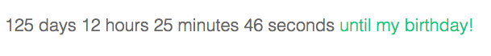

# react-count-down

react-count-down is a simple count down component using react.js.



## Installation

`npm install react-count-down --save`

## Usage

```javascript
var React = require('react');
var CountDown = require('react-count-down');

var OPTIONS = { endDate: '06/03/2015 10:12 AM', prefix: 'until my birthday!' }

React.renderComponent(<CountDown options={OPTIONS} />, document.getElementById("container"));

```

## Styles

react-count-down can be used with your own custom styles. A minimal count-down.css style sheet is included as a guide.

## Development

Initial set up, run:
    
    npm install

## License

[MIT](http://isekivacenz.mit-license.org/)
